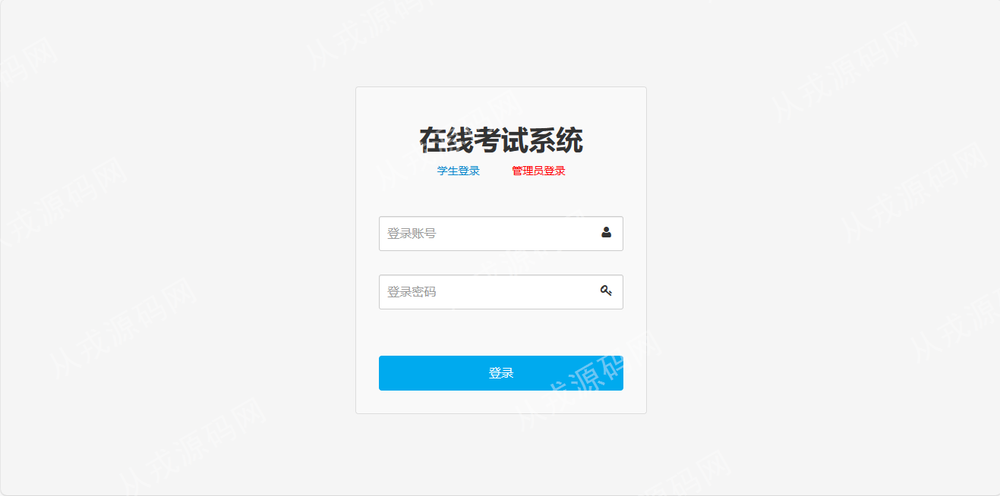
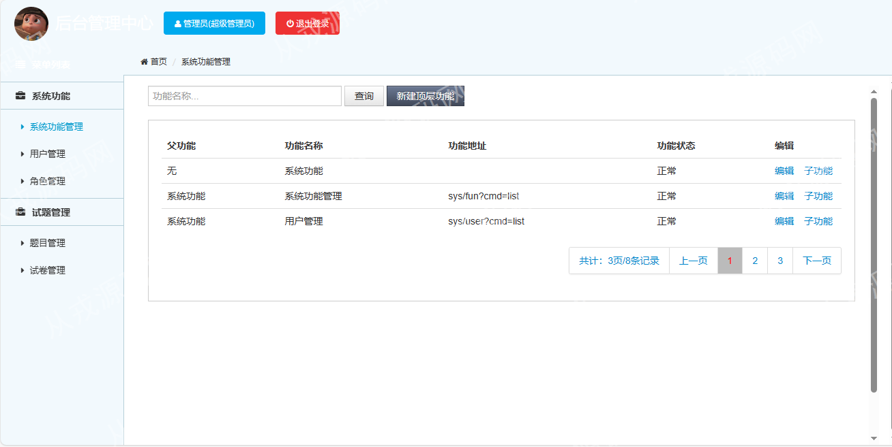
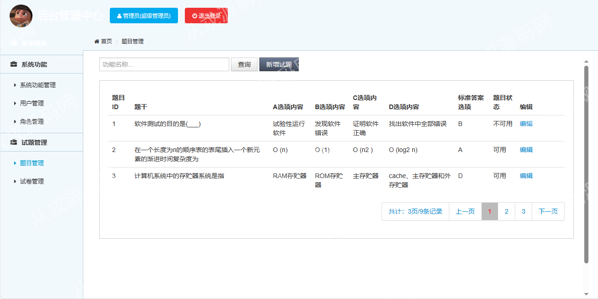
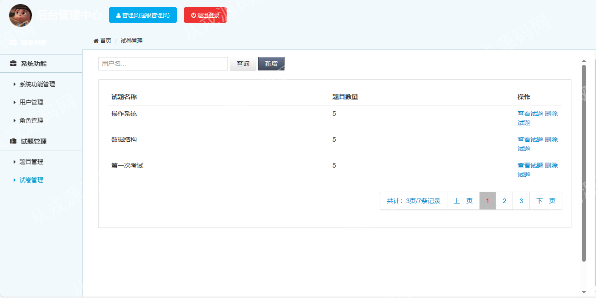
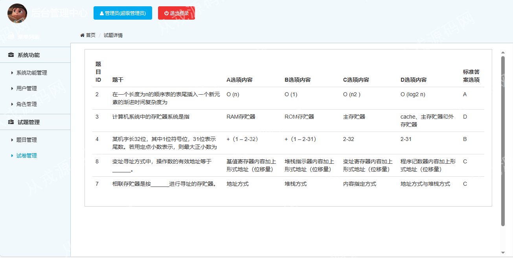
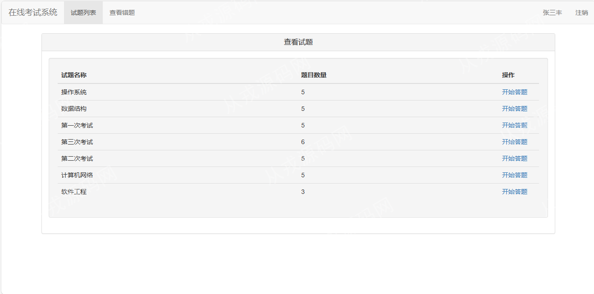
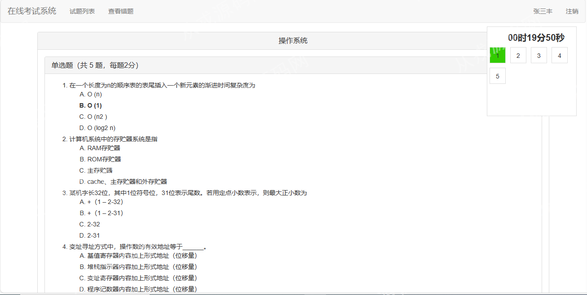
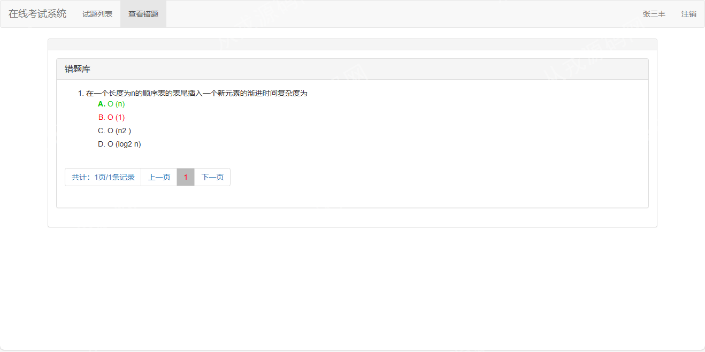

<h1 align="center">70.在线考试管理系统</h1>

 获取sql文件 QQ: 386869957 QQ群: 377586148 

 [推荐站点: 从戎源码网](https://armycodes.com/) 

## 简介

> 本代码来源于网络,仅供学习参考使用!
>
> 提供1.远程部署/2.修改代码/3.设计文档指导/4.框架代码讲解等服务
> 
> 访问地址：http://localhost:8080/
> 
> 管理员：admin 123456
> 
> 学生：student 123456
> 
> 

## 项目介绍
基于jsp+servlet的在线考试管理系统：前端jsp、jquery、bootstrap，后端 servlet、jdbc，集成在线答题、查看错题、管理员发布试卷和试题等功能于一体的系统。

## 功能介绍

### 学生

- 在线答题：从试题列表中选择一套试题，点击开始答题，进入在线答题环节，开始答题后，右上角回显示答题倒计数和答题进度，每次答完一题会实时更新，确认答完题，点击最下方的交卷
- 查看错题：交卷后可以查看自己哪些题目做错了，错题会用红色进行标记，并绿色进行标注正确答案，便于学生复习错题

### 管理员

- 题目管理：题目的增删改查，关键词搜索，题干加选项，标准答案选项，试题状态为锁定状态则为不可用
- 试卷管理：试卷的增删改查，关键词搜索，填入试卷名称和数量
- 系统功能管理：菜单列表查询，子功能编辑
- 用户管理：用户信息的增改查，关键词搜索
- 角色管理：角色信息的增改查，权限分配

## 环境

- <b>IntelliJ IDEA 2021.3</b>

- <b>Mysql 5.7.26</b>

- <b>Tomcat 7.0.73</b>

- <b>JDK 1.8</b>

## 运行截图

